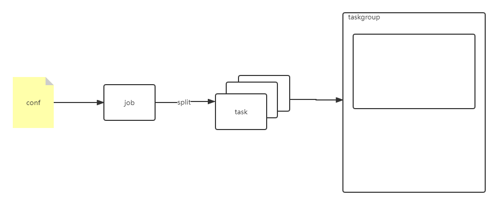

## 实现范围


## 代码
1. job, task, taskgroup结构
```
// speed 用来控制并发数量，也就是taskgroup数量
job: id, speed
task: reader, writer 
taskgroup: id
```
2. split函数和如何加载插件(奖励点)
https://www.cnblogs.com/yjf512/p/16065604.html
- init函数; golang加载机制:初始化变量->init函数->main函数
- map函数初始化; var是map定义, make才是初始化, 定义map = make
- 依赖问题可以通过队列和是否执行来判断, 当插件依赖没有满足时, 再次插入队列


## 思考
1. datax数据 job, task, taskgroup结构以及用途
datax基于配置体现数据,查看配置文件
```
// job
"job":{
    "id":0,
    "mode":"standalone",
    "reportInterval":10000
}

// taskGroup
"taskGroup":{
    "channel":5,
    "id":0
}

// task
{
    "reader": {
        "name": "streamreader",
        "parameter": {
            "column": [
                "{\"type\":\"long\",\"value\":\"10\"}",
                "{\"type\":\"string\",\"value\":\"hello，你好，世界-DataX\"}"
            ],
            "sliceRecordCount": 20
        }
    },
    "taskId": 1,
    "writer": {
        "name": "streamwriter",
        "parameter": {
            "encoding": "UTF-8",
            "print": true
        }
    }
}
```
- taskGroup定义了channel数量, 对应task数量, 因为datax的设计channel和task是一一对应的 
- task是实现了Reader和Writer的job
- job一对多task, taskgroup一对多task, job其实是一对多taskgroup, 但是每一个taskgroup一个线程, 可以看作一对一


## 功能
1. 插件加载功能
2. 结构化配置文件
3. 生成taskgroup流程